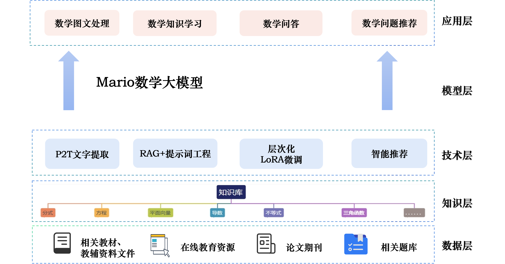
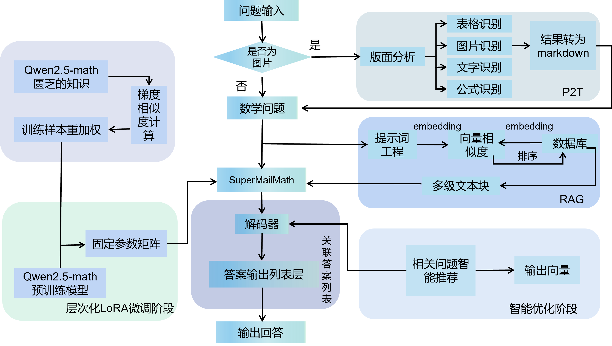
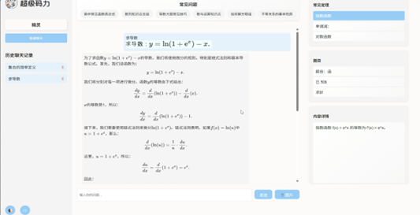
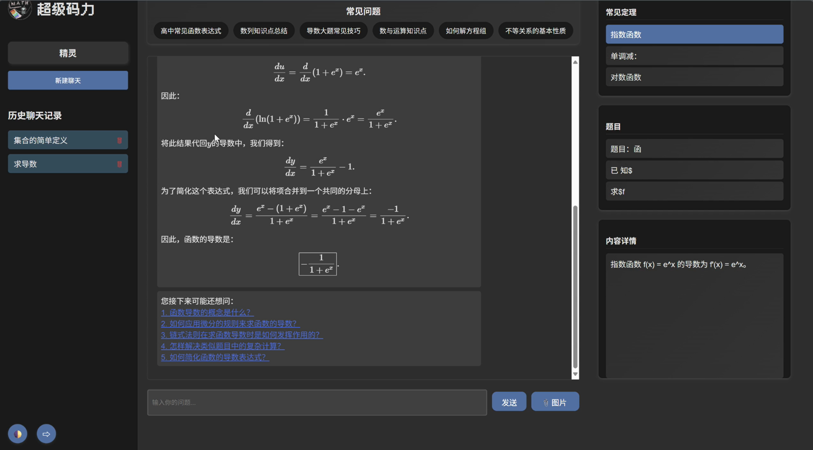
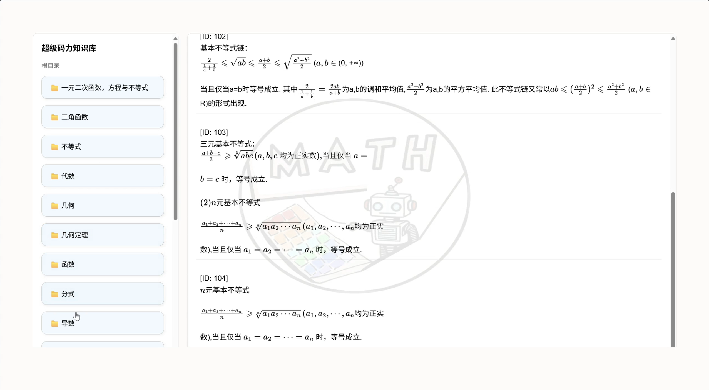

<h1 align="center">超级码力</h1>
<p align="center">
  
</p>

---

## 项目介绍

基于 RAG 和大模型的算术与数学问题解答系统

1. **数学知识库**：本系统从多种来源获取了数学相关的知识，覆盖了从小学到高中全学段，形成支持多场景的知识库，为精准问答提供扎实数据支撑。
2. **SuperMailmath 模型**：本系统基于 Qwen2.5-Math 模型，融合多模态思维链增强架构与动态推理路径规划算法，创新采用双通道验证。相比普通模型，本系统解题能力更强。
3. **定制化 Meta-Lora 微调**：本研究创新引入 Meta-Lora 架构，运用双层优化机制。同时定制特殊数据集，依问题难度与类型测试模型，以此针对性解决模型答案生成过程中的不足。
4. **RAG 技术**：该技术融合信息检索与文本生成技术，借助 all-MiniLM-L6-v2 和 BertModel 双模型将文本转为稠密向量，使系统生成文本时，能从外部知识库提取信息，提升文本准确性与丰富度，降低幻觉率。
5. **P2T 技术**：该技术结合了深度学习技术，通过大量数据的训练不断优化自身性能，能够自动学习和提取图片中的特征，能够精准识别和提取各种复杂的数学公式。

## 创新点

1. **基于分类引导与自我反思的 prompt 设计**  
   - **分类引导**：将数学问题类别分类作为目标，引入提示词。  
   - **自我反思**：双向反思与验证机制，正向验证检查解题过程是否符合调用的定理/性质；反向验证验证定理/性质是否匹配问题需求。

2. **融合类别信息的多层次多类型数学知识库构建**  
   - **融合类别构建知识条目**：类别 + 子类别 + 知识组合，提升后续检索精度。  
   - **多层次数学类型划分**：十六大类及若干子类。  
   - **多类型数学知识构建**：组成定理 - 技巧 - 例题多类型体系。

3. **基于层次化微调的 Mario 数学大模型**  
   - 提出了层次化微调方法（Hierarchical-LORA）：通过融合数据集重加权与差异化设置不同层次学习率，实现对数学大模型轻量化、定制化微调。

4. **多类型增强交互界面设计**  
   - **知识增强**：用户向系统发出提问后，RAG 检索得到的相关知识【定理、技巧及例题】被显示在页面。  
   - **角色增强**：系统预定义不同类型使用人群的 Prompt 模版，以提升交互友好程度。  
   - **提问诱导增强**：基于 step-by-step 策略，逐步帮助用户解题。

## 整体架构



## 技术路线



## 界面展示







## 目录结构

```bash
├─ dbshow/                     # 知识库展示模块（包含后端接口）
│  └─ knowledge_db/            # 知识库文件
│
├─ flask/                      # 后端服务模块
│  ├─ db/                      # 数据库相关文件
│  ├─ __pycache__/             
│  ├─ index.py                 # 常规接口（问题推荐、常见问题处理等）
│  └─ p2t.py                   # 图片转文本接口（需独立虚拟环境）
│
├─ model_url/                  # 大模型服务模块
│  └─ model.py                 # 大模型流式响应接口
│
├─ qwen2.5-math-1.5B-ft/        # 微调模块
│  ├─ train2.py                # 最终微调版本
│  ├─ train3.py                # 微调训练代码
│  ├─ use_stream.py            # 微调模型流式测试代码
│  └─ output/                  # 微调后模型输出目录
│      └─ qwen2.5_math_7B_ft_1/
│          └─ checkpoint-35/
│
├─ rag/                        # RAG模块
│  └─ rag_url.py               # RAG后端接口（其余为测试代码）
│
├─ tiqv/                       # 知识库题目与答案分离辅助工具
│
└─ www/                        # 前端页面
   ├─ index.html               # 登录界面
   ├─ main.html                # 主界面
   ├─ dbshow.html              # 新版知识库展示界面
   └─ show_kdb.html            # 旧版知识库展示界面
```

---

## 安装与依赖

本项目主要基于 Python 开发，建议使用虚拟环境分别运行各后端模块，避免依赖冲突。

### 环境要求

- Python >= 3.9
- CUDA >= 11.8（如需本地运行大模型）
- 现代浏览器（支持 HTML5 与 WebSocket）

### 快速安装

在项目根目录下创建并激活虚拟环境：

```bash
python -m venv venv
source venv/bin/activate      # Linux / macOS
# venv\Scripts\activate       # Windows
```

安装常用依赖：

```bash
pip install -r requirements.txt
```

> 提示：`flask/p2t.py` 涉及图片识别，建议在独立虚拟环境中安装其专属依赖，避免与主环境版本冲突。

---

## 使用说明

### 一、前端运行

#### 页面入口

1. `./www/index.html` —— 登录界面  
2. `./www/main.html` —— 主界面  
3. `./www/dbshow.html` —— 知识库展示界面  

#### 启动方式

在 `www` 目录下启动本地 HTTP 服务，端口设置为：

```bash
http://localhost:8000
```

---

### 后端接口说明

| 路径 | 说明 |
|------|------|
| `./flask/index.py` | 常规接口（问题推荐、常见问题处理等） |
| `./flask/p2t.py` | 图片识别接口（需单独创建 p2t 虚拟环境运行） |
| `./model_url/model.py` | 大模型流式回答接口 |
| `./rag/rag_url.py` | RAG 检索增强生成接口 |
| `./dbshow/index.py` | 知识库展示接口 |

---

### 运行注意事项

- 确保各后端服务端口与前端页面api调用端口配置一致  
- `p2t` 需在独立虚拟环境中运行  
- 微调模型路径需正确配置  
- 启动顺序建议：后端接口 → 大模型服务 → RAG 服务 → 前端服务